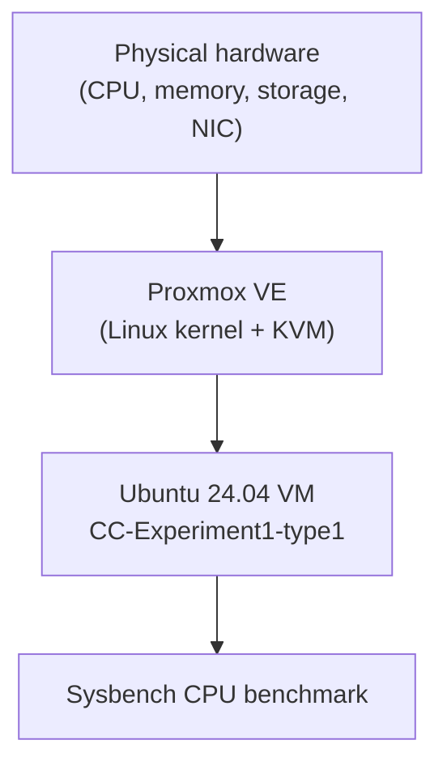
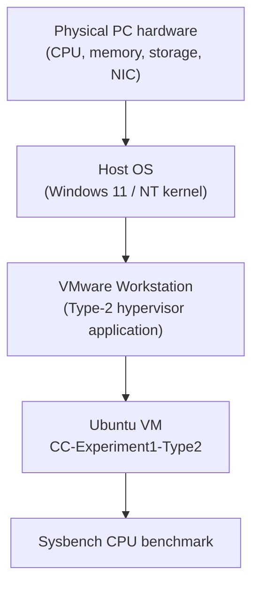
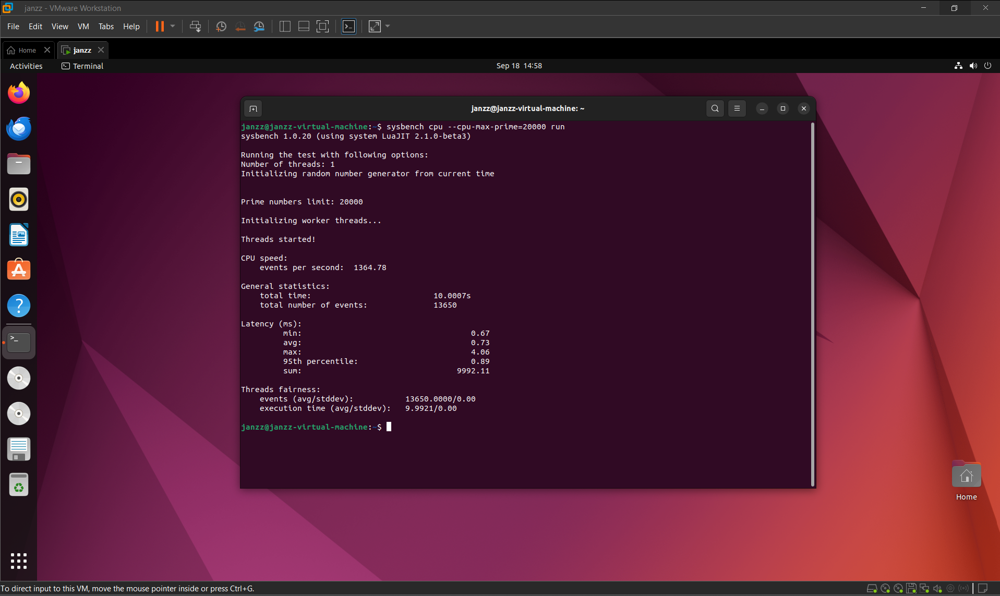
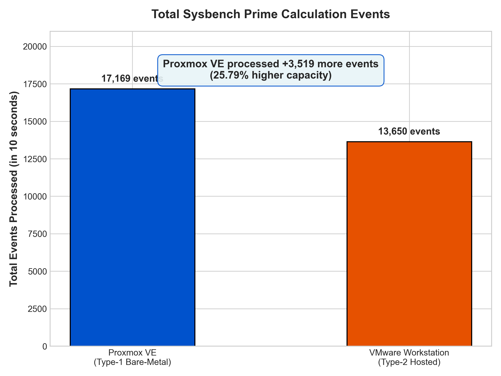
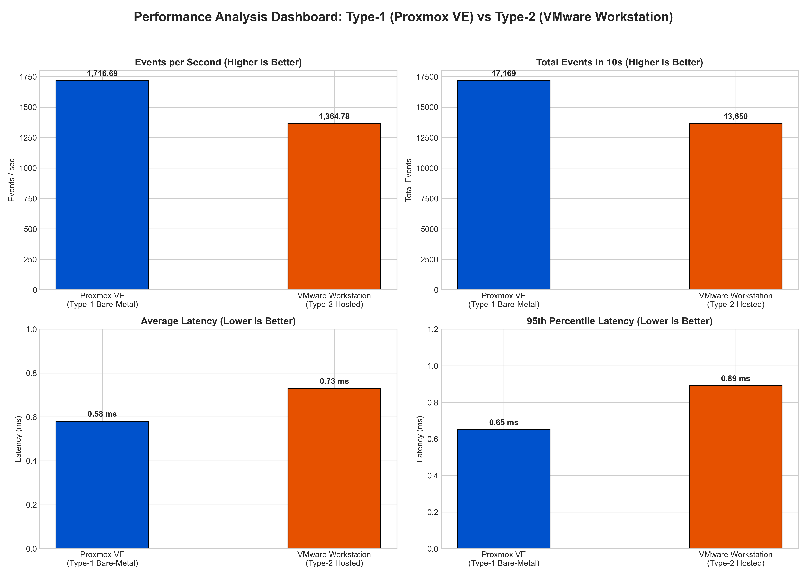

# Type-1 vs Type-2 Hypervisor CPU Performance Study

[](#)
[](#)
[](#)
[](#)

---

## Summary

This repository holds everything from a lab study that compares CPU performance on a **Type-1 (bare-metal) hypervisor, Proxmox VE**, and a **Type-2 (hosted) hypervisor, VMware Workstation**: the setup steps, raw benchmark output, charts, and the written report.

An Ubuntu virtual machine with the same specs (2 vCPUs, 2 GB RAM, 20 GB disk) was created on each platform. The `sysbench` prime-number CPU test (`--cpu-max-prime=20000`) was then run on both under the same conditions.

### Headline Result

> **Proxmox VE reached 1,716.69 events/sec versus 1,364.78 events/sec on VMware Workstation. That is roughly 25.8% more throughput and a 20.55% drop in average latency for the bare-metal hypervisor.**

---

## Contents

1. [Objectives](#1-objectives)
2. [Architecture of the Two Hypervisor Types](#2-architecture-of-the-two-hypervisor-types)
3. [VM Specifications](#3-vm-specifications)
4. [Procedure](#4-procedure)
5. [Results and Screenshots](#5-results-and-screenshots)
6. [Comparison Table](#6-comparison-table)
7. [Metric Definitions and Charts](#7-metric-definitions-and-charts)
8. [Analysis](#8-analysis)
9. [Conclusion](#9-conclusion)
10. [Repository Layout and Reproduction](#10-repository-layout-and-reproduction)

---

## 1. Objectives

This lab experiment was designed to:

1. **Deploy** two matching Ubuntu VMs on different hypervisor designs:
   - **Type-1 (bare-metal):** Proxmox VE, built on KVM
   - **Type-2 (hosted):** VMware Workstation Pro running on a Windows host
2. **Keep resources equal** (2 vCPUs, 2048 MB RAM, 20 GB disk) so the results can be compared fairly.
3. **Benchmark** CPU virtualization efficiency with `sysbench`, testing primes up to 20,000.
4. **Collect metrics:** run time, total events, throughput (events/sec), and latency (min, avg, max, 95th percentile).
5. **Measure overhead:** determine how much the host-OS layer under a Type-2 hypervisor costs compared with running directly on hardware.

---

## 2. Architecture of the Two Hypervisor Types

### Type-1: Proxmox VE (Bare-Metal)

Proxmox VE is installed directly on the physical machine. Its Linux kernel, extended with KVM, serves as the hypervisor. Guest instructions run on the CPU through the Intel VT-x / AMD-V extensions, with no desktop operating system in between.



```text
+-------------------------------------------------------------------+
|               Ubuntu Virtual Machine (Type-1 guest)               |
+-------------------------------------------------------------------+
|               Proxmox VE Hypervisor (Linux kernel / KVM)          |
+-------------------------------------------------------------------+
|                Physical server hardware (bare metal)              |
+-------------------------------------------------------------------+
```

---

### Type-2: VMware Workstation (Hosted)

VMware Workstation is a regular application running under a host OS (Windows 11 or 10). Requests from the guest CPU pass through VMware's virtual machine monitor, get translated into host OS calls, and are finally scheduled by the Windows NT kernel before they reach the hardware.



```text
+-------------------------------------------------------------------+
|               Ubuntu Virtual Machine (Type-2 guest)               |
+-------------------------------------------------------------------+
|               VMware Workstation (virtual machine monitor)        |
+-------------------------------------------------------------------+
|               Host operating system (Windows 11 / 10)             |
+-------------------------------------------------------------------+
|                        Physical PC hardware                       |
+-------------------------------------------------------------------+
```

---

## 3. VM Specifications

To keep the comparison fair, both VMs were set up with the same resources:

| Parameter | Proxmox VE (Type-1) | VMware Workstation (Type-2) | Match |
| :--- | :--- | :--- | :--- |
| **VM name** | `CC-Experiment1-type1` | `CC-Experiment1-Type2` | Standardized |
| **VM identifier** | `VMID 123` | `janzz-virtual-machine` | Standardized |
| **Guest OS** | Ubuntu 24.04.3 LTS (AMD64) | Ubuntu Linux 64-bit | Standardized |
| **CPU allocation** | 2 vCPUs (1 socket, 2 cores) | 2 vCPUs (1 processor, 2 cores) | Identical |
| **CPU model** | `x86-64-v2-AES` | Host passthrough / default | Closely matched |
| **RAM** | 2048 MiB (2.0 GB) | 2048 MB (2.0 GB) | Identical |
| **Virtual disk** | 20.0 GB | 20.0 GB | Identical |
| **Network adapter** | VirtIO (`vmbr0`) | NAT (`VMnet8`) | Standardized |
| **Benchmark tool** | `sysbench 1.0.20` | `sysbench 1.0.20` | Identical |

---

## 4. Procedure

### Step 1: Create the Virtual Machines

1. **Proxmox VE (Type-1)**
   - Opened `https://10.11.0.252:8006` in a browser.
   - Started the `Create VM` wizard with VM ID `123` and the name `CC-Experiment1-type1`.
   - Attached the Ubuntu 24.04 ISO and assigned 2 cores, 2048 MiB RAM, a 20 GB VirtIO disk, and the `vmbr0` bridge.
   - Finished the Ubuntu installation.

2. **VMware Workstation (Type-2)**
   - Opened VMware Workstation on the Windows host.
   - Picked the `Typical` configuration path.
   - Selected the Ubuntu ISO and named the VM `CC-Experiment1-Type2`.
   - Set a 20 GB disk, 1 processor with 2 cores (2 vCPUs in total), 2 GB RAM, and a NAT adapter.
   - Finished the Ubuntu installation.

### Step 2: Check the Configuration

Inside each guest, the following commands confirmed the specs before benchmarking:

```bash
# 1. Hostname and system architecture
hostnamectl

# 2. CPU topology and core count
lscpu

# 3. Memory size
free -h

# 4. Disk partitions and capacity
df -h

# 5. Live process and load view
top
```

### Step 3: Install and Run Sysbench

```bash
# Refresh package lists and install Sysbench
sudo apt update && sudo apt install sysbench -y

# Confirm the version
sysbench --version

# Run the CPU test (primes up to 20,000)
sysbench cpu --cpu-max-prime=20000 run
```

---

## 5. Results and Screenshots

### Type-1: Proxmox VE

Screenshot `images/1.png`, taken from the Proxmox VE noVNC web console:


*Figure 1: Sysbench output on Proxmox VE (Type-1).*

---

### Type-2: VMware Workstation

Screenshot `images/2.png`, taken from VMware Workstation:



*Figure 2: Sysbench output on VMware Workstation (Type-2).*

---

## 6. Comparison Table

The values below come directly from the two benchmark runs:

| Metric | Proxmox VE (Type-1) | VMware Workstation (Type-2) | Difference | Better |
| :--- | :---: | :---: | :---: | :---: |
| **Hypervisor type** | Bare-metal | Hosted | Design | Type-1 has direct hardware control |
| **Guest OS** | Ubuntu | Ubuntu | Same | Equal baseline |
| **vCPUs** | 2 | 2 | Same | Equal compute |
| **RAM** | 2 GB | 2 GB | Same | Equal memory |
| **Disk** | 20 GB | 20 GB | Same | Equal storage |
| **Prime limit** | 20,000 | 20,000 | Same | Equal workload |
| **Run time** | **10.0004 s** | **10.0007 s** | ~0.003% | Fixed 10 s window |
| **Total events** | **17,169** | **13,650** | **+3,519 (+25.78%)** | **Proxmox VE** |
| **Events/sec** | **1,716.69** | **1,364.78** | **+351.91 (+25.79%)** | **Proxmox VE** |
| **Min latency** | **0.57 ms** | **0.67 ms** | **−0.10 ms (−14.93%)** | **Proxmox VE** |
| **Avg latency** | **0.58 ms** | **0.73 ms** | **−0.15 ms (−20.55%)** | **Proxmox VE** |
| **95th percentile latency** | **0.65 ms** | **0.89 ms** | **−0.24 ms (−26.97%)** | **Proxmox VE (steadier)** |
| **Max latency** | **2.78 ms** | **4.06 ms** | **−1.28 ms (−31.53%)** | **Proxmox VE (fewer spikes)** |

---

## 7. Metric Definitions and Charts

### What Each Metric Means

1. **Run time (seconds):** Wall-clock length of the test. It was fixed at about 10 seconds.
2. **Events per second (throughput):** Prime-checking iterations completed each second. **Higher is better.**
3. **Total events:** All prime-checking iterations finished in the test window. **Higher is better.**
4. **Latency (milliseconds):** Time taken by each event. **Lower is better.**
   - **Min:** fastest single event.
   - **Avg:** mean time across all events.
   - **95th percentile:** the value 95% of events stayed under, a good indicator of consistency.
   - **Max:** slowest single event, which exposes scheduling spikes.

---

### Chart 1: Throughput (Events/sec)


*Figure 3: Throughput comparison, with Proxmox VE about 25.8% ahead.*

---

### Chart 2: Latency Metrics


*Figure 4: Min, average, 95th percentile, and max latency for both hypervisors.*

---

### Chart 3: Total Events



*Figure 5: Events completed in 10 seconds (17,169 vs 13,650).*

---

### Chart 4: Overall Dashboard



*Figure 6: Multi-panel dashboard summarizing all metrics.*

---

## 8. Analysis

The data shows that Proxmox VE (Type-1) clearly outperforms VMware Workstation (Type-2) on this CPU-bound workload.

### 1. Virtualization Overhead

- **Proxmox VE** uses Linux KVM, which works directly with the Intel VT-x / AMD-V extensions. Guest instructions run in VMX root-mode mediation with very little hypervisor interference.
- **VMware Workstation** sits on top of Windows. Privileged guest operations are handled twice: once by VMware's virtual machine monitor and again by the Windows kernel through user-to-kernel mode transitions (`NtSystemService`).

### 2. Scheduling and Context Switching

- On Proxmox VE, each guest vCPU is an ordinary host Linux thread managed by the **Completely Fair Scheduler (CFS)**.
- On VMware Workstation, the guest competes with Windows background activity such as Windows Defender, update services, and the Desktop Window Manager. Preemption by the host scheduler produces latency spikes, which is why max latency was 4.06 ms on VMware versus 2.78 ms on Proxmox.

### 3. Memory Translation

- Proxmox VE relies on hardware-assisted address translation (Extended Page Tables / Nested Page Tables).
- A Type-2 setup pays an extra cost when translating addresses along the path Guest Physical Address → Host Virtual Address → Host Physical Address.

---

## 9. Conclusion

1. **Bare metal wins on speed:** Proxmox VE delivered about **25.8% higher CPU throughput** and **20.55% lower average latency** than VMware Workstation.
2. **Steadier response times:** Proxmox VE's 95th percentile latency was 0.65 ms against 0.89 ms, which matters for latency-sensitive production systems.
3. **Where to use each:**
   - **Type-1 (Proxmox VE, KVM, ESXi):** cloud data centers, production infrastructure, database servers, and high-performance computing.
   - **Type-2 (VMware Workstation, VirtualBox):** local development, testing, desktop sandboxes, and teaching labs.

---

## 10. Repository Layout and Reproduction

### Folder Structure

```text
Cloud_computing/
│
├── README.md                                            # Project overview and benchmark write-up
├── LAB_REPORT.md                                        # Formal lab report for submission
├── Lab-Manual-Hypervisor-Performance-Analysis (1).docx  # Reference lab manual
│
├── images/                                              # Screenshots and generated charts
│   ├── 1.png                                            # Proxmox VE Sysbench screenshot
│   ├── 2.png                                            # VMware Workstation Sysbench screenshot
│   ├── events_per_second_comparison.png                 # Throughput chart
│   ├── latency_comparison.png                           # Latency chart
│   ├── total_events_comparison.png                      # Total events chart
│   └── overall_performance_dashboard.png                # Multi-panel dashboard
│
└── scripts/                                             # Automation and plotting scripts
    ├── benchmark.sh                                     # Runs the Sysbench test
    ├── generate_plots.py                                # Builds the charts with Matplotlib
    └── parse_sysbench.py                                # Parses results and computes ratios
```

### Reproducing the Experiment

1. **Run the benchmark script inside a VM:**

   ```bash
   chmod +x scripts/benchmark.sh
   ./scripts/benchmark.sh
   ```

2. **Generate the charts:**

   ```bash
   python scripts/generate_plots.py
   ```

3. **Parse and compare the results:**

   ```bash
   python scripts/parse_sysbench.py
   ```

---

*Conducted as a laboratory experiment for the Cloud Computing / Computer Networks course.*
